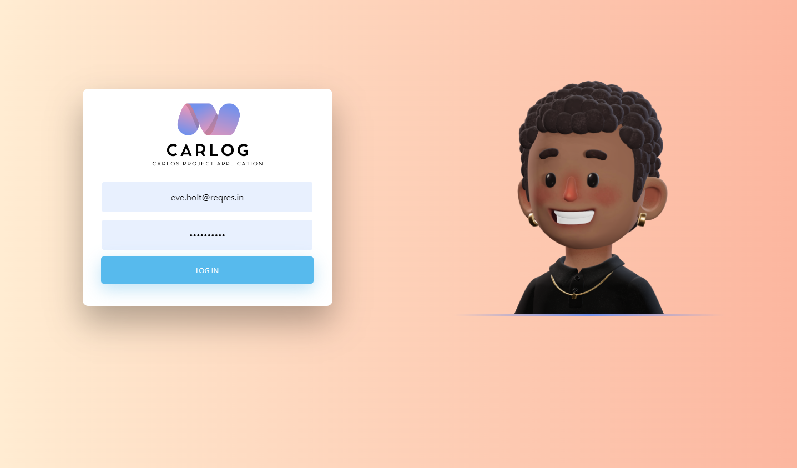
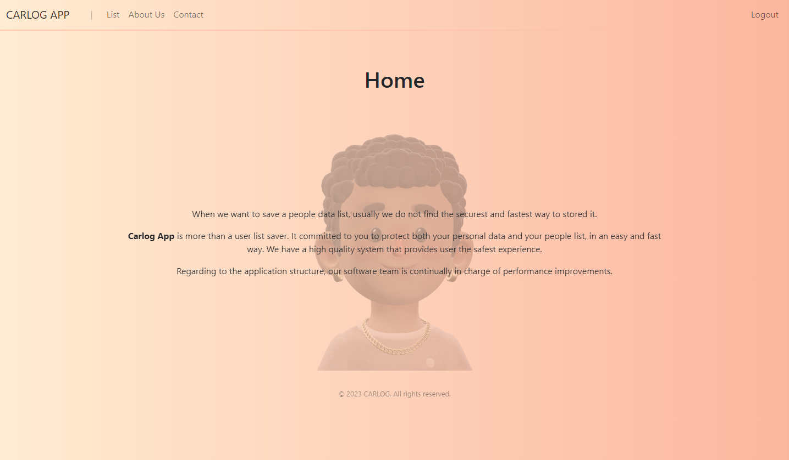
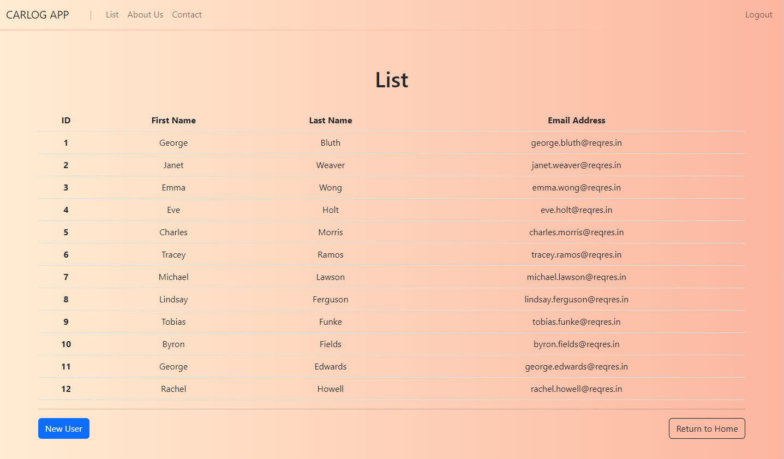
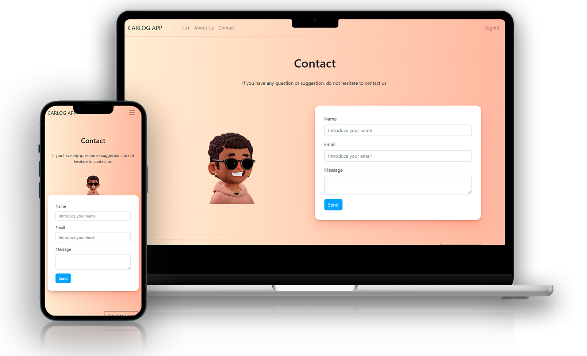

# Carlos Project Application
En este proyecto hemos simulado la creación de un sitio web llamado **Carlog App**, perteneciente a la empresa **Carlog**, en la que a través del framework de JavaScript, Angular, hemos diseñado un sistema de login y listado de usuarios, con el objetivo de realizar las operaciones CRUD haciendo uso de una API llamada [**Reqres**](https://reqres.in/).

 

  

 

Además de realizar las operaciones CRUD, también hemos incorporado Lazy Loading con el objetivo de mejorar la performance del sitio web. Por otra parte hemos implementado sistemas de autenticación para login, guardas y servicios que impiden acceder a determinadas partes de la aplicación en caso de no estar autorizado. Por otro lado, hemos implementado un logout para poder finalizar nuestra sesión como usuario dentro de la aplicación. Además, también hemos creado una página de error personalizada, de forma que en caso de querer acceder a una URL que no se corresponde con ninguna existente, nos redirija a dicha página de error automáticamente. Por últmo, comentar también que hemos hecho uso de los tipos genéricos que nos ofrece TypeScript, de forma que podamos hacer el tipado de datos más robusto.

Para probar la aplicación, el login se debe realizar con el nombre de usuario de alguno de los proporcionados por la API, junto con la contraseña que queramos. Uno de los usuarios que se proporciona es *eve.holt@reqres.in*.

En cuanto a lo que UX/UI se refiere, hemos procurado que la aplicación sea 100% responsive, para que se pueda tener una buen experiencia de usuario desde cualquier dispositivo.

# Tecnologías utilizadas
     

## Mi nombre es Carlos López 👋🏾
### Software Developer

Me dedico al desarrollo software y en GitHub comparto todos los proyectos que he realizado hasta el momento. Mi objetivo es compartir con la comunidad mi progreso como programador y también mi conocimiento, por si pudiera ser de ayuda.

### Accede a mi perfil para más información

